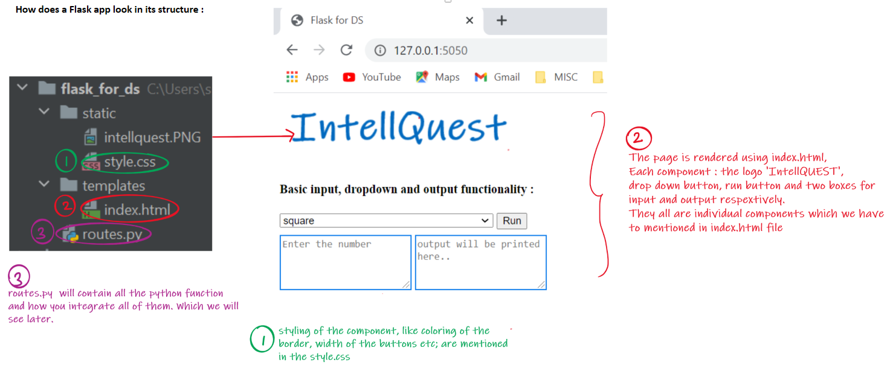
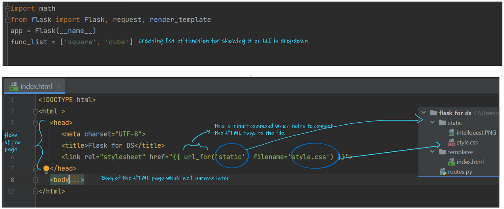
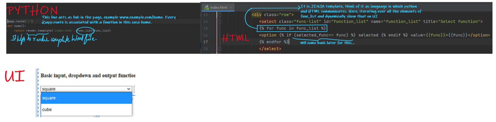
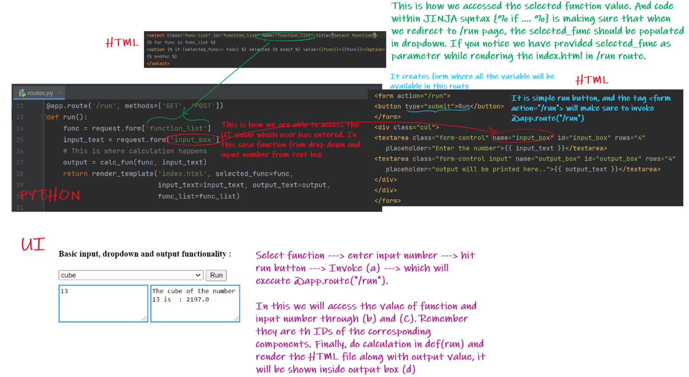
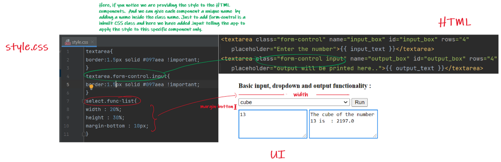

# Flask for Data Scientist
### Note : In this repository, routes.py is the main file. This code/blog is for someone who is familiar with what flask is and it's purpose. This will help them to connect the dots.
### Introduction :  
This blog is coming from someone who has learnt data science from basics through videos , tutorials, certification courses etc. Not having a computer science background, if there is any tool I have wanted to learn or understand , I have always done it in a data sciency way ; which starts with understanding the purpose followed by putting all the build components together. And this is very much the approach that would be followed in our blogs.
I do not use technical jargons very much, rather focus on getting along the logic and purpose behind the solutions.

### Pre- Requisite :  
Basic Python  - Ah! Long time since you last used it ?? No worries at all , you can refresh your python from [basic-to-advance-python-course](https://github.com/spdubey/basic-to-advance-python-course).
### What are we trying to achieve ?  
I am going to demo/explain a very basic app also including the approach we follow to connect different components of a flask app. In case we want to do some mind goggling and hit a more complicated app with complex features, please put in your comments and I will definitely try to come up with another blog on that. So make sure you add in your reviews and comments, Guys!

### Design:
#### We will have an app with:
  - One Input Text Box : User can input the data – which can be any number  
  - A Dropdown – having values : square root and cube root for selection  
  - One Output Box : Depending on the value selected in the above Dropdown, this will display the calculated output  

This might not make sense  as of now but the idea here is to understand how we can input the data, transform or apply any functions on it and display the output on a web page. Instead of the above use case where we are trying to get a square or cube root of a number, we can develop any and many ML models depending on different types of use cases.

**Just a Thought** : I have created this example with bare minimum requirement. When I started learning about how one  can create an aesthetically appealing UI using Flask, I came across multiple hurdles , one of them was  JavaScript. I had never used JavaScript earlier but as I started digging deeper, I managed to  incorporate JavaScript as well in the code  which will serve a very small functionality. Probably will  be creating a blog on that as well. For now let us focus on this app without JavaScript.

### How does a flask app looks?

**STEP – 1** :  Keeping python script(routes.py) as my base , let us see how simultaneously it is connected with index.html  
  - Below code snippet is independent of html page, it is kind of a boiler plate code [what is a Boiler Plate Code?](https://en.wikipedia.org/wiki/Boilerplate_code)  
  - Similarly, in index.html we have the <head> tag which includes path for style.css    
  
  
**STEP – 2** :  Comparing Python to the HTML Code – Here it shows how we are passing elements to our Dropdown. The UI shows our designed Dropdown

  
  
**STEP – 3** :  Code – Description/Explanation added for each of the code component  

  

**STEP – 4** :  So now, our final output looks something like this -
  
  
**Challenges I faced**: I did not have background in JavaScript , also was not much into HTML scripts, so  it took me a while to wrap my head around these. But eventually I was able to get a grip of it and implement the code. 

